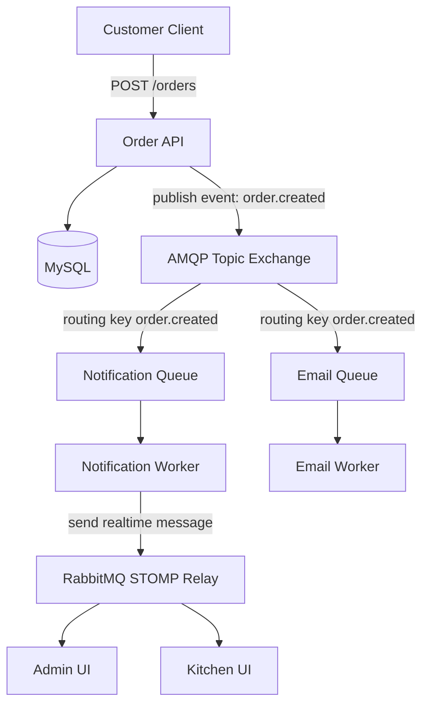

# Technical Design Document - Nền tảng Realtime

| **Field** | **Value** |
|-----------|-----------|
| **Document ID** | TDD-PINE-REALTIME-001 |
| **Project** | Pine Drink - Hệ thống order đồ uống online |
| **Module** | Realtime Foundation - nền tảng realtime dùng chung |
| **Version** | 1.0 |
| **Status** | Draft |
| **Author** | Pine Drink Dev Team |
| **Last Updated** | 2026-06-05 |

---

## 1. Mục tiêu

Xây dựng một nền tảng realtime dùng chung cho các module sau:

- **Order**: tạo đơn, đổi trạng thái đơn, cập nhật thanh toán, cập nhật kitchen board.
- **Chat**: customer-support chat, branch staff chat, room messages.
- **Notification**: thông báo riêng cho user, cảnh báo admin, broadcast theo branch.

Realtime base phải generic, bảo mật, tái sử dụng được, không phụ thuộc riêng vào Order hay Chat.

### 1.1 Quy ước ngôn ngữ

- Dùng **tiếng Việt** cho business rule, mục tiêu, flow nghiệp vụ, giải thích quyết định thiết kế.
- Giữ **tiếng Anh** cho technical terms phổ biến: WebSocket, STOMP, broker, topic, queue, payload, event, publish, subscribe, interceptor, endpoint.
- Giữ nguyên tên class/package/method/destination/code để dev triển khai không bị lệch.
- Comment/code sample dùng English ngắn gọn nếu nằm trong code; phần mô tả bên ngoài dùng tiếng Việt.

---

## 2. Công nghệ đề xuất

### 2.1 Primary: WebSocket + STOMP

Sử dụng **Spring WebSocket + STOMP** làm realtime stack chính.

Lý do:

- Hỗ trợ **bidirectional**: client -> server và server -> client.
- Dùng được cho cả **chat** và **order events**.
- STOMP giúp routing rõ ràng qua destination: `/app/**`, `/topic/**`, `/queue/**`.
- Spring hỗ trợ sẵn `SimpMessagingTemplate`, interceptors, user destinations, message broker config.
- Dễ mở rộng sau này bằng RabbitMQ/Redis broker relay.

### 2.2 SockJS Fallback

Dùng **SockJS** như fallback nếu cần hỗ trợ browser cũ hoặc network không ổn định.

Khuyến nghị mặc định:

- Bật SockJS ở giai đoạn dev/frontend compatibility.
- Vẫn ưu tiên native WebSocket làm main path.

### 2.3 JWT Authentication

Dùng JWT auth hiện có từ auth module.

JWT được gửi trong STOMP `CONNECT` frame:

```text
CONNECT
Authorization: Bearer <accessToken>
```

Backend validate token trong `ChannelInterceptor`, sau đó set authenticated user vào STOMP session.

### 2.4 Message Broker

Vì mục tiêu là tối ưu hiệu năng và làm base dùng lâu dài cho cả chat + order, chọn **RabbitMQ ngay từ đầu**.

RabbitMQ sẽ phục vụ 2 vai trò khác nhau:

1. **STOMP broker relay** cho realtime delivery.
   - Client subscribe `/topic/**`, `/queue/**`, `/user/queue/**`.
   - Spring WebSocket Gateway relay message qua RabbitMQ STOMP plugin.
   - Phù hợp cho fanout order/chat events tới nhiều clients.

2. **AMQP message queue** cho async domain events.
   - Business modules publish event qua exchange: `pine.events`.
   - Consumers xử lý notification, audit, retry, webhook, background jobs.
   - Có DLQ để không mất event lỗi.

Spring simple broker chỉ dùng làm **fallback/dev mode**, không phải production default.

| Layer | Technology | Purpose |
|-------|------------|---------|
| Realtime transport | WebSocket + STOMP | Kết nối client realtime |
| Realtime broker | RabbitMQ STOMP plugin | Route `/topic/**`, `/queue/**` giữa nhiều backend instances |
| Async event broker | RabbitMQ AMQP | Queue domain events, retry, DLQ |
| Auth | JWT + STOMP interceptor | Validate `CONNECT`, set Principal |
| Pub/Sub API | `SimpMessagingTemplate` | Publish realtime event từ backend |

### 2.5 RabbitMQ Production Recommendation

Docker image nên dùng:

```text
rabbitmq:3-management
```

Plugins cần bật:

```text
rabbitmq_stomp
rabbitmq_web_stomp
rabbitmq_management
```

Ports:

```text
5672   AMQP
61613  STOMP
15672  Management UI
15674  Web STOMP (optional)
```

Security:

- Không dùng `guest/guest` ở production.
- Tạo user riêng: `pine_realtime`.
- Giới hạn vhost: `/pine`.
- Backend giữ RabbitMQ credentials trong env/config, không hardcode.

---

## 3. High-Level Architecture

```text
┌──────────────────────────────────────────────────────────────────────────────┐
│                                  Clients                                     │
├──────────────────────────────┬──────────────────────────────┬────────────────┤
│ Customer Web/App             │ Staff/Kitchen Screen          │ Admin Console  │
│ - receive order updates      │ - receive branch order feed   │ - monitor ops  │
│ - send chat messages         │ - send status updates         │ - send notices │
└───────────────┬──────────────┴──────────────┬───────────────┴───────┬────────┘
                │ WebSocket/STOMP             │ WebSocket/STOMP        │
                ▼                              ▼                       ▼
┌──────────────────────────────────────────────────────────────────────────────┐
│                    Spring Boot WebSocket Gateway                             │
├──────────────────────────────────────────────────────────────────────────────┤
│  /ws endpoint                                                                 │
│  ┌──────────────────────┐   ┌──────────────────────┐   ┌──────────────────┐ │
│  │ WebSocketConfig      │   │ JwtStompInterceptor  │   │ SubscribeGuard   │ │
│  │ - endpoint /ws       │──►│ - validate CONNECT   │──►│ - validate topic │ │
│  │ - broker relay       │   │ - set Principal      │   │ - scope/member   │ │
│  └──────────────────────┘   └──────────────────────┘   └──────────────────┘ │
│                                                                              │
│  ┌──────────────────────┐   ┌──────────────────────┐   ┌──────────────────┐ │
│  │ RealtimeController   │   │ RealtimePublishSvc   │   │ RealtimeEvent    │ │
│  │ - /app/chat.send     │──►│ - publishToUser      │──►│ - type/version   │ │
│  │ - /app/order.*       │   │ - publishToTopic     │   │ - payload        │ │
│  └──────────────────────┘   └──────────────────────┘   └──────────────────┘ │
└───────────────┬──────────────────────────────────────────────┬───────────────┘
                │ STOMP broker relay                           │ AMQP publish
                ▼                                               ▼
┌───────────────────────────────────┐          ┌───────────────────────────────┐
│ RabbitMQ STOMP Broker             │          │ RabbitMQ AMQP Event Broker    │
│ - /topic/orders/{id}              │          │ Exchange: pine.events         │
│ - /topic/chat/rooms/{roomId}      │          │ Queues: notification, audit   │
│ - /user/queue/notifications       │          │ DLQ: pine.events.dlq          │
└─────────────────┬─────────────────┘          └───────────────┬───────────────┘
                  │ realtime MESSAGE                            │ async consume
                  ▼                                               ▼
┌──────────────────────────────────────────────────────────────────────────────┐
│                              Business Modules                                │
├──────────────────────────────┬──────────────────────────────┬────────────────┤
│ Order Module                 │ Chat Module                  │ Notification   │
│ - create order               │ - room message               │ - private msg  │
│ - change status              │ - typing/read event          │ - branch alert │
│ - payment callback           │ - support channel            │ - system alert │
└──────────────────────────────┴──────────────────────────────┴────────────────┘
```

### 3.1 Tổng quan những gì sẽ triển khai

| Nhóm | Triển khai | Mục đích |
|------|------------|----------|
| WebSocket Gateway | `/ws`, STOMP config, broker relay | Cổng realtime cho client |
| Authentication | `JwtStompChannelInterceptor` | Validate JWT khi `CONNECT` |
| Authorization | `StompSubscribeGuard` | Chặn subscribe topic không có quyền |
| Realtime Core | `RealtimeEvent`, `RealtimeEventFactory`, `RealtimePublishService` | Chuẩn hóa event/publish |
| RabbitMQ STOMP | broker relay tới RabbitMQ | Scale realtime fanout |
| RabbitMQ AMQP | exchange/queue/DLQ | Async domain event processing |
| Order Integration | publish `ORDER_*` events after commit | Cập nhật order realtime |
| Chat Integration | `/app/chat.send`, room topic | Chat realtime 2 chiều |
| Notification | `/user/queue/notifications` | Private notification cho user |
| Observability | logs + metrics | Theo dõi connection/message/error |

---

## 4. STOMP Routing Model

### 4.1 Prefixes

| Prefix | Direction | Purpose |
|--------|-----------|---------|
| `/ws` | HTTP upgrade | WebSocket handshake endpoint |
| `/app/**` | Client -> Server | Client sends commands/messages to backend |
| `/topic/**` | Server -> Many clients | Broadcast topics |
| `/queue/**` | Server -> One user/session | Private queue |
| `/user/queue/**` | Server -> authenticated user | Spring user destination |

### 4.2 Destination Naming

```text
/topic/orders/{orderId}
/topic/branches/{branchId}/orders
/topic/chat/rooms/{roomId}
/topic/system/announcements

/user/queue/notifications
/user/queue/orders
/user/queue/chat

/app/chat.send
/app/chat.typing
/app/orders.subscribe
/app/orders.status.update
```

### 4.3 Routing Diagram

```text
Client SEND /app/chat.send
        │
        ▼
┌──────────────────┐
│ RealtimeController│
└────────┬─────────┘
         │ validate room membership
         ▼
┌──────────────────┐
│ ChatService       │
└────────┬─────────┘
         │ persist message
         ▼
┌──────────────────┐
│ PublishService    │
└────────┬─────────┘
         │ convertAndSend
         ▼
/topic/chat/rooms/{roomId}
         │
         ▼
Subscribers receive MESSAGE
```

```text
OrderService.changeStatus()
        │
        ▼
┌──────────────────┐
│ Domain Event      │ ORDER_STATUS_CHANGED
└────────┬─────────┘
         ▼
┌──────────────────┐
│ PublishService    │
└───┬───────────┬───┘
    │           │
    ▼           ▼
/topic/orders/{orderId}
/user/queue/orders  (customer owner)
    │           │
    ▼           ▼
Order detail page + customer notification
```

---

## 5. Core Components

### 5.1 WebSocketConfig

File: `configuration/WebSocketConfig.java`

Responsibilities:

- Register `/ws` endpoint.
- Enable RabbitMQ STOMP broker relay for `/topic` and `/queue`.
- Configure application prefix `/app`.
- Configure user destination prefix `/user`.
- Register STOMP channel interceptor for JWT auth.

Expected config:

```java
@Configuration
@EnableWebSocketMessageBroker
@RequiredArgsConstructor
public class WebSocketConfig implements WebSocketMessageBrokerConfigurer {

    private final JwtStompChannelInterceptor jwtStompChannelInterceptor;

    @Value("${spring.rabbitmq.host}")
    private String rabbitMqHost;

    @Value("${spring.rabbitmq.username}")
    private String rabbitMqUser;

    @Value("${spring.rabbitmq.password}")
    private String rabbitMqPassword;

    @Override
    public void registerStompEndpoints(StompEndpointRegistry registry) {
        registry.addEndpoint("/ws")
                .setAllowedOriginPatterns("*")
                .withSockJS();
    }

    @Override
    public void configureMessageBroker(MessageBrokerRegistry registry) {
        registry.setApplicationDestinationPrefixes("/app");
        registry.enableStompBrokerRelay("/topic", "/queue")
                .setRelayHost(rabbitMqHost)
                .setRelayPort(61613)
                .setClientLogin(rabbitMqUser)
                .setClientPasscode(rabbitMqPassword)
                .setSystemLogin(rabbitMqUser)
                .setSystemPasscode(rabbitMqPassword);
        registry.setUserDestinationPrefix("/user");
    }

    @Override
    public void configureClientInboundChannel(ChannelRegistration registration) {
        registration.interceptors(jwtStompChannelInterceptor);
    }
}
```

### 5.2 JwtStompChannelInterceptor

File: `security/websocket/JwtStompChannelInterceptor.java`

Responsibilities:

- Read `Authorization` header from STOMP `CONNECT`.
- Validate JWT.
- Load `UserPrincipal` or lightweight principal.
- Set principal on STOMP accessor.
- Reject invalid/expired token.

Flow:

```text
CONNECT frame
   │
   ├─ Missing Authorization -> allow only if endpoint supports guest? default reject
   ├─ Invalid token -> reject CONNECT
   └─ Valid token -> set Principal(accountId, authorities) -> session authenticated
```

### 5.3 RealtimeEvent Envelope

File: `realtime/RealtimeEvent.java`

Generic event wrapper for all realtime payloads.

```java
@Getter
@Setter
@Builder
@NoArgsConstructor
@AllArgsConstructor
public class RealtimeEvent<T> {
    private String eventId;
    private String type;
    private int version;
    private String actorId;
    private String targetType;
    private String targetId;
    private T payload;
    private Instant occurredAt;
}
```

Example:

```json
{
  "eventId": "9af5a74f-7e52-4e99-a033-3c81271c6d5f",
  "type": "ORDER_STATUS_CHANGED",
  "version": 1,
  "actorId": "staff-account-id",
  "targetType": "ORDER",
  "targetId": "order-id",
  "payload": {
    "orderId": "order-id",
    "oldStatus": "PENDING",
    "newStatus": "CONFIRMED"
  },
  "occurredAt": "2026-06-05T10:15:30Z"
}
```

### 5.4 RealtimePublishService

File: `realtime/RealtimePublishService.java`

Responsibilities:

- Hide `SimpMessagingTemplate` from business modules.
- Provide typed publish methods.
- Standardize destination names.
- Log event delivery.

Interface:

```java
public interface RealtimePublishService {
    <T> void publishToTopic(String destination, RealtimeEvent<T> event);
    <T> void publishToUser(String accountId, String destination, RealtimeEvent<T> event);
    <T> void publishOrderEvent(String orderId, RealtimeEvent<T> event);
    <T> void publishBranchOrderEvent(String branchId, RealtimeEvent<T> event);
    <T> void publishChatRoomEvent(String roomId, RealtimeEvent<T> event);
}
```

Implementation:

```java
@Service
@RequiredArgsConstructor
public class RealtimePublishServiceImpl implements RealtimePublishService {

    private final SimpMessagingTemplate messagingTemplate;

    @Override
    public <T> void publishToTopic(String destination, RealtimeEvent<T> event) {
        messagingTemplate.convertAndSend(destination, event);
    }

    @Override
    public <T> void publishToUser(String accountId, String destination, RealtimeEvent<T> event) {
        messagingTemplate.convertAndSendToUser(accountId, destination, event);
    }

    @Override
    public <T> void publishOrderEvent(String orderId, RealtimeEvent<T> event) {
        publishToTopic("/topic/orders/" + orderId, event);
    }

    @Override
    public <T> void publishBranchOrderEvent(String branchId, RealtimeEvent<T> event) {
        publishToTopic("/topic/branches/" + branchId + "/orders", event);
    }

    @Override
    public <T> void publishChatRoomEvent(String roomId, RealtimeEvent<T> event) {
        publishToTopic("/topic/chat/rooms/" + roomId, event);
    }
}
```

### 5.5 Realtime Event Factory

File: `realtime/RealtimeEventFactory.java`

Purpose:

- Centralize event creation.
- Avoid duplicated event envelope construction.

```java
@Component
public class RealtimeEventFactory {
    public <T> RealtimeEvent<T> create(String type, String actorId,
                                       String targetType, String targetId, T payload) {
        return RealtimeEvent.<T>builder()
                .eventId(UUID.randomUUID().toString())
                .type(type)
                .version(1)
                .actorId(actorId)
                .targetType(targetType)
                .targetId(targetId)
                .payload(payload)
                .occurredAt(Instant.now())
                .build();
    }
}
```

### 5.6 RabbitMQ AMQP Event Structure

RabbitMQ AMQP dùng cho async processing, không thay thế WebSocket/STOMP.

Exchange chính:

```text
pine.events        type=topic durable=true
```

Routing keys:

```text
order.created
order.status.changed
order.cancelled
payment.status.changed
chat.message.sent
notification.created
```

Queues:

| Queue | Bindings | Consumer |
|-------|----------|----------|
| `pine.notification.queue` | `order.*`, `payment.*`, `notification.*` | Notification consumer |
| `pine.audit.queue` | `#` | Audit/event log consumer |
| `pine.chat.queue` | `chat.*` | Chat persistence/side-effect consumer |
| `pine.webhook.queue` | `order.*`, `payment.*` | External webhook consumer |
| `pine.events.dlq` | DLQ target | Failed messages |

DLX config:

```text
x-dead-letter-exchange = pine.events.dlx
x-dead-letter-routing-key = failed
```

### 5.7 DomainEventPublisher

File: `event/DomainEventPublisher.java`

Responsibilities:

- Publish domain events to RabbitMQ AMQP exchange.
- Keep business module independent from RabbitMQ classes.
- Support retry/DLQ through broker config.

Interface:

```java
public interface DomainEventPublisher {
    <T> void publish(String routingKey, RealtimeEvent<T> event);
}
```

Implementation:

```java
@Service
@RequiredArgsConstructor
public class RabbitDomainEventPublisher implements DomainEventPublisher {

    private final RabbitTemplate rabbitTemplate;

    @Override
    public <T> void publish(String routingKey, RealtimeEvent<T> event) {
        rabbitTemplate.convertAndSend("pine.events", routingKey, event);
    }
}
```

### 5.8 Event Publish Pattern

Business modules should publish both:

1. **Realtime event** to STOMP topics for live UI.
2. **Domain event** to AMQP exchange for async side effects.

Example:

```text
OrderService.changeStatus()
  │
  ├─ update DB transaction
  └─ afterCommit
       ├─ realtimePublishService.publishOrderEvent(orderId, event)
       └─ domainEventPublisher.publish("order.status.changed", event)
```

### 5.9 Order Created Async Flow

Flow này dùng khi tạo order: API lưu DB trước, sau đó publish domain event qua AMQP Topic Exchange. Worker nhận event, xử lý side effects, rồi push realtime message qua RabbitMQ STOMP Relay tới Admin/Kitchen UI.



ASCII fallback:

```text
Customer Client
   │ POST /orders
   ▼
Order API ───────────────► MySQL
   │
   │ publish event: order.created
   ▼
AMQP Topic Exchange
   ├─ routing key order.created ─► Notification Queue ─► Notification Worker
   │                                                        │
   │                                                        │ send realtime message
   │                                                        ▼
   │                                                   RabbitMQ STOMP Relay
   │                                                        ├─► Admin UI
   │                                                        └─► Kitchen UI
   │
   └─ routing key order.created ─► Email Queue ───────► Email Worker
```

Design note:

- `Order API` không gửi email/notification trực tiếp để response nhanh hơn.
- `Order API` chỉ đảm bảo DB transaction thành công, sau đó publish `order.created` sau commit.
- `Notification Worker` quyết định realtime destination:
  - `/topic/branches/{branchId}/orders` cho Kitchen/Admin branch view.
  - `/user/queue/orders` cho customer owner.
  - `/user/queue/notifications` cho private notification.
- `Email Worker` xử lý email async riêng, không làm chậm order creation.

---

## 6. Event Types

### 6.1 Order Events

| Type | Target | Payload | Destination |
|------|--------|---------|-------------|
| `ORDER_CREATED` | `ORDER` | `OrderCreatedPayload` | `/topic/branches/{branchId}/orders`, `/user/queue/orders` |
| `ORDER_STATUS_CHANGED` | `ORDER` | `OrderStatusChangedPayload` | `/topic/orders/{orderId}`, `/topic/branches/{branchId}/orders`, `/user/queue/orders` |
| `ORDER_CANCELLED` | `ORDER` | `OrderCancelledPayload` | `/topic/orders/{orderId}`, `/topic/branches/{branchId}/orders` |
| `PAYMENT_STATUS_CHANGED` | `ORDER` | `PaymentStatusChangedPayload` | `/topic/orders/{orderId}`, `/user/queue/orders` |

Payload example:

```java
@Getter @Setter @Builder
public class OrderStatusChangedPayload {
    private String orderId;
    private String orderCode;
    private String oldStatus;
    private String newStatus;
    private String reason;
    private String branchId;
    private String customerAccountId;
}
```

### 6.2 Chat Events

| Type | Target | Payload | Destination |
|------|--------|---------|-------------|
| `CHAT_MESSAGE_SENT` | `CHAT_ROOM` | `ChatMessagePayload` | `/topic/chat/rooms/{roomId}` |
| `CHAT_TYPING_STARTED` | `CHAT_ROOM` | `TypingPayload` | `/topic/chat/rooms/{roomId}` |
| `CHAT_TYPING_STOPPED` | `CHAT_ROOM` | `TypingPayload` | `/topic/chat/rooms/{roomId}` |
| `CHAT_MESSAGE_READ` | `CHAT_ROOM` | `ReadReceiptPayload` | `/topic/chat/rooms/{roomId}` |

Payload example:

```java
@Getter @Setter @Builder
public class ChatMessagePayload {
    private String roomId;
    private String messageId;
    private String senderId;
    private String senderName;
    private String content;
    private Instant sentAt;
}
```

### 6.3 Notification Events

| Type | Target | Payload | Destination |
|------|--------|---------|-------------|
| `NOTIFICATION_CREATED` | `ACCOUNT` | `NotificationPayload` | `/user/queue/notifications` |
| `BRANCH_ALERT` | `BRANCH` | `BranchAlertPayload` | `/topic/branches/{branchId}/alerts` |
| `SYSTEM_ANNOUNCEMENT` | `SYSTEM` | `AnnouncementPayload` | `/topic/system/announcements` |

---

## 7. Security Design

### 7.1 Authentication

Authentication is done at STOMP `CONNECT`.

```text
Client
  │
  │ CONNECT Authorization: Bearer JWT
  ▼
JwtStompChannelInterceptor
  │
  ├─ validate token
  ├─ parse accountId
  ├─ load authorities
  └─ set Principal(accountId)
```

### 7.2 Authorization

Do not rely only on topic names. Validate business permissions before publishing or accepting commands.

Examples:

- Customer can subscribe only to own order topic.
- Staff can subscribe to branch order feed only if assigned to that branch.
- Chat user can send message only to rooms they belong to.

Implementation options:

1. **ChannelInterceptor SUBSCRIBE guard**
   - Check destination on `SUBSCRIBE`.
   - Verify access via `AccessScopeService` or room membership service.

2. **Controller/service command guard**
   - For `/app/**` commands, validate in service method.
   - Use `@MessageMapping` plus business checks.

Recommended: use both.

### 7.3 Destination Access Matrix

| Destination | Who can subscribe/send | Guard |
|-------------|------------------------|-------|
| `/user/queue/**` | Current authenticated user only | Spring user destination |
| `/topic/orders/{orderId}` | Order owner, assigned branch staff, admin | `OrderAccessService` |
| `/topic/branches/{branchId}/orders` | Staff/admin with branch access | `AccessScopeService.assertCanAccessBranch` |
| `/topic/chat/rooms/{roomId}` | Customer owner, branch staff/admin | `ChatAccessService` |
| `/app/chat.send` | Room member | message service guard |
| `/app/orders.status.update` | Staff/admin with branch management | scope + permission guard |

---

## 8. Realtime + Order Integration

Order module publishes realtime events after DB transaction succeeds.

Recommended: publish after commit, not inside transaction before commit.

Use Spring transaction synchronization:

```java
private void publishAfterCommit(Runnable publisher) {
    TransactionSynchronizationManager.registerSynchronization(new TransactionSynchronization() {
        @Override
        public void afterCommit() {
            publisher.run();
        }
    });
}
```

Usage:

```java
publishAfterCommit(() -> realtimePublishService.publishOrderEvent(order.getId(), event));
```

Order creation flow:

```text
OrderService.createOrder()
  │
  ├─ Save order/items/history in DB transaction
  ├─ Register afterCommit publisher
  └─ Commit
       │
       ▼
     Publish ORDER_CREATED
       ├─ /topic/branches/{branchId}/orders
       └─ /user/queue/orders
```

Order status flow:

```text
Staff changes status
  │
  ▼
OrderService.changeStatus()
  │
  ├─ Validate branch access
  ├─ Update order.status
  ├─ Save status history
  └─ afterCommit publish ORDER_STATUS_CHANGED
       ├─ /topic/orders/{orderId}
       ├─ /topic/branches/{branchId}/orders
       └─ /user/queue/orders
```

---

## 9. Realtime + Chat Integration

Chat module uses same base but adds persistence.

Chat MVP dùng 2 bảng:

- `ch_room`
- `ch_message`

Ảnh/file chat không lưu binary trong DB hay đẩy qua WebSocket. File upload vào MinIO, còn `ch_message.metadata` chỉ lưu `objectKey`, `fileName`, `contentType`, `size`, `url` nếu cần.

Chat flow:

```text
Client SEND /app/chat.send
  │
  ▼
ChatRealtimeController
  │
  ├─ Validate room membership
  ├─ Persist message
  ├─ Build RealtimeEvent<ChatMessagePayload>
  └─ Publish to /topic/chat/rooms/{roomId}
```

Chat minimal components:

```text
chat/
├── ChatRoom
├── ChatMessage
├── ChatService
├── ChatRealtimeController
└── ChatMapper
```

MVP chat chỉ cần `ChatRoom` và `ChatMessage`. `ChatRoomMember` sẽ bổ sung sau nếu cần group chat hoặc unread/read receipt chi tiết.

Realtime base should not depend on chat entities.

---

## 10. Data Contracts

### 10.1 Client CONNECT

```javascript
const client = new StompJs.Client({
  brokerURL: 'ws://localhost:8080/ws',
  connectHeaders: {
    Authorization: `Bearer ${accessToken}`
  },
  reconnectDelay: 5000,
  heartbeatIncoming: 10000,
  heartbeatOutgoing: 10000
});
```

### 10.2 Subscribe Order Detail

```javascript
client.subscribe(`/topic/orders/${orderId}`, (message) => {
  const event = JSON.parse(message.body);
  if (event.type === 'ORDER_STATUS_CHANGED') {
    updateOrderStatus(event.payload.newStatus);
  }
});
```

### 10.3 Subscribe Private Notifications

```javascript
client.subscribe('/user/queue/notifications', (message) => {
  const event = JSON.parse(message.body);
  showNotification(event.payload);
});
```

### 10.4 Send Chat Message

```javascript
client.publish({
  destination: '/app/chat.send',
  body: JSON.stringify({
    roomId: 'room-id',
    content: 'Hello'
  })
});
```

---

## 11. Operational Concerns

### 11.1 Heartbeat

Use heartbeat to detect broken connections.

Recommended:

```text
heartbeatIncoming: 10000 ms
heartbeatOutgoing: 10000 ms
```

### 11.2 Reconnect

Client should reconnect automatically:

```text
reconnectDelay: 5000 ms
max reconnect jitter: optional
```

### 11.3 Scaling

Production target dùng RabbitMQ ngay từ đầu:

```text
┌──────────┐      ┌──────────────┐
│ Client A │─────►│ Backend #1   │────┐
└──────────┘      └──────────────┘    │
                                      ▼
                               ┌────────────┐
                               │ RabbitMQ   │ STOMP Relay + AMQP
                               │ Broker     │
                               └────────────┘
                                      ▲
┌──────────┐      ┌──────────────┐    │
│ Client B │─────►│ Backend #2   │────┘
└──────────┘      └──────────────┘
```

Dev fallback nếu muốn chạy nhanh local không RabbitMQ:

```text
Client -> Backend instance -> SimpleBroker
```

Fallback này chỉ nên bật bằng config profile `local-simple-broker`.

### 11.4 Observability

Log these events:

- CONNECT accepted/rejected
- DISCONNECT
- SUBSCRIBE accepted/rejected
- MESSAGE command received
- publish event type + destination
- publish failure

Metrics to track later:

- active WebSocket sessions
- messages published per minute
- failed publishes
- subscription count per topic
- average handler latency

---

## 12. Folder Structure

```text
src/main/java/com/hoandev/pinedrink/
├── configuration/
│   ├── WebSocketConfig.java
│   └── RabbitMqConfig.java
├── security/
│   └── websocket/
│       ├── JwtStompChannelInterceptor.java
│       ├── StompPrincipal.java
│       └── StompAccessGuard.java
├── realtime/
│   ├── RealtimeEvent.java
│   ├── RealtimeEventFactory.java
│   ├── RealtimeEventType.java
│   ├── RealtimeDestination.java
│   ├── RealtimePublishService.java
│   └── impl/
│       └── RealtimePublishServiceImpl.java
├── event/
│   ├── DomainEventPublisher.java
│   └── impl/
│       └── RabbitDomainEventPublisher.java
├── realtime/payload/
│   ├── OrderCreatedPayload.java
│   ├── OrderStatusChangedPayload.java
│   ├── PaymentStatusChangedPayload.java
│   ├── ChatMessagePayload.java
│   ├── TypingPayload.java
│   └── NotificationPayload.java
└── controller/realtime/
    ├── ChatRealtimeController.java
    └── OrderRealtimeController.java
```

---

## 13. Implementation Phases

### Phase 1 - Foundation

- Add `spring-boot-starter-websocket` if missing.
- Add RabbitMQ dependency/config (`spring-boot-starter-amqp`).
- Add RabbitMQ Docker service + enable STOMP plugins.
- Create `WebSocketConfig`.
- Configure STOMP broker relay to RabbitMQ.
- Create JWT STOMP interceptor.
- Create `RealtimeEvent`, `RealtimeEventFactory`.
- Create `RealtimePublishService`.
- Create `DomainEventPublisher` for AMQP events.
- Add private `/user/queue/notifications` publish test.

### Phase 2 - Order Integration

- Publish `ORDER_CREATED` after order creation commit.
- Publish `ORDER_STATUS_CHANGED` after status update commit.
- Publish `PAYMENT_STATUS_CHANGED` after payment callback.
- Add branch order feed: `/topic/branches/{branchId}/orders`.

### Phase 3 - Chat Integration

- Create chat room/message entities.
- Add `/app/chat.send`.
- Publish to `/topic/chat/rooms/{roomId}`.
- Add typing/read receipt events.

### Phase 4 - Scale

- Tune RabbitMQ queues/exchanges/DLQ.
- Add broker monitoring and metrics dashboards.
- Add load test for WebSocket fanout.
- Add broker HA if deployment requires it.

---

## 14. Risks & Mitigations

| Risk | Impact | Mitigation |
|------|--------|------------|
| Unauthorized topic subscription | Data leak | SUBSCRIBE guard + service-level checks |
| Publish before DB commit | Client sees stale/nonexistent data | Publish after transaction commit |
| RabbitMQ unavailable | Realtime delivery interrupted | health check + reconnect + alerting |
| Queue backlog grows | Delayed notifications/jobs | metrics + DLQ + consumer scaling |
| Token expires during connection | Long-lived stale auth | Heartbeat + reconnect + optional session TTL check |
| Chat scope grows too large | Delay order module | Build realtime base first, chat minimal later |

---

## 15. Acceptance Criteria

- `/ws` endpoint accepts WebSocket/STOMP connections.
- RabbitMQ STOMP broker relay is configured for `/topic` and `/queue`.
- RabbitMQ AMQP exchange `pine.events` is configured.
- `CONNECT` with valid JWT succeeds.
- `CONNECT` with invalid JWT is rejected.
- Authenticated user can receive `/user/queue/notifications` message.
- Backend can publish generic `RealtimeEvent<T>` to topic.
- Backend can publish generic `RealtimeEvent<T>` to user queue.
- Backend can publish generic `RealtimeEvent<T>` to RabbitMQ AMQP exchange.
- Order module can publish `ORDER_CREATED` and `ORDER_STATUS_CHANGED` without knowing `SimpMessagingTemplate`.
- Chat module can publish `CHAT_MESSAGE_SENT` using the same foundation.
- Topic names follow documented convention.
- Compile passes with `./mvnw -q -DskipTests compile`.

---

## 16. Checklist

- [ ] Add dependency: `spring-boot-starter-websocket`
- [ ] Add dependency: `spring-boot-starter-amqp`
- [ ] Add RabbitMQ Docker service
- [ ] Enable RabbitMQ plugins: `rabbitmq_stomp`, `rabbitmq_web_stomp`, `rabbitmq_management`
- [ ] Create `WebSocketConfig`
- [ ] Configure `enableStompBrokerRelay("/topic", "/queue")`
- [ ] Create `RabbitMqConfig`
- [ ] Create `JwtStompChannelInterceptor`
- [ ] Create `StompPrincipal`
- [ ] Create `RealtimeEvent<T>`
- [ ] Create `RealtimeEventType`
- [ ] Create `RealtimeDestination`
- [ ] Create `RealtimeEventFactory`
- [ ] Create `RealtimePublishService`
- [ ] Create `RealtimePublishServiceImpl`
- [ ] Create `DomainEventPublisher`
- [ ] Create `RabbitDomainEventPublisher`
- [ ] Create exchange `pine.events`
- [ ] Create queues: `pine.notification.queue`, `pine.audit.queue`, `pine.chat.queue`, `pine.webhook.queue`, `pine.events.dlq`
- [ ] Add test endpoint/publisher for `/user/queue/notifications`
- [ ] Add order payload DTOs
- [ ] Integrate order publish-after-commit
- [ ] Add chat payload DTOs
- [ ] Add minimal `ChatRealtimeController`
- [ ] Add SUBSCRIBE guard for order/chat topics
- [ ] Add frontend connection sample
