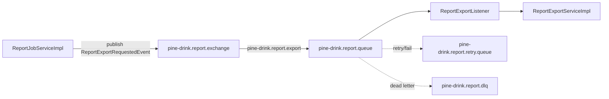
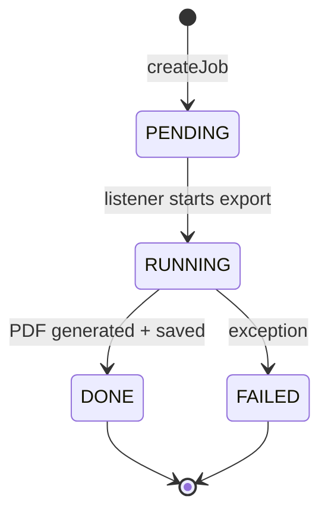

# Report Export Architecture

Tài liệu tổng hợp phần xuất báo cáo của Pine Drink: luồng hoạt động, RabbitMQ, Jasper PDF, query dữ liệu lớn, cách thêm report mới và các lưu ý vận hành.

## 1. Mục tiêu

Report export được thiết kế theo hướng bất đồng bộ:

- API tạo job nhanh, không chờ sinh file PDF.
- Worker report xử lý nền qua RabbitMQ riêng.
- Dữ liệu lớn dùng native projection, không load entity JPA dư.
- File sau khi sinh được lưu storage, client tải lại bằng job id.
- Trạng thái job được lưu trong `rp_export_request`.

## 2. Report đang hỗ trợ

| Report type | Mục đích | Filter chính | Output |
| --- | --- | --- | --- |
| `INVOICE` | Xuất hóa đơn 1 đơn hàng | `orderId` hoặc `orderCode` | PDF |
| `DAILY_REVENUE` | Báo cáo doanh thu theo chi nhánh/ngày | `branchId`, `fromDate`, `toDate` | PDF |
| `PRODUCT_CATALOG` | Xuất danh sách sản phẩm | `status`, `categoryId` | PDF |

Ví dụ tạo job xuất sản phẩm:

```json
{
  "reportType": "PRODUCT_CATALOG",
  "fileFormat": "PDF",
  "filters": "{\"status\":\"ACTIVE\"}"
}
```

Không filter sẽ xuất toàn bộ sản phẩm:

```json
{
  "reportType": "PRODUCT_CATALOG",
  "fileFormat": "PDF",
  "filters": "{}"
}
```

## 3. Luồng tổng thể

```mermaid
flowchart TD
    A[Client FE] -->|POST /api/v1/reports/jobs| B[ReportJobController]
    B --> C[ReportJobServiceImpl.createJob]
    C --> D[(rp_export_request<br/>status=PENDING)]
    C -->|afterCommit| E[Publish ReportExportRequestedEvent]
    E --> F[pine-drink.report.exchange]
    F -->|routingKey pine-drink.report.export| G[pine-drink.report.queue]
    G --> H[ReportExportListener]
    H --> I[ReportExportServiceImpl.export]
    I --> J{ReportType}
    J -->|INVOICE| K[Build invoice data]
    J -->|DAILY_REVENUE| L[Build daily revenue data]
    J -->|PRODUCT_CATALOG| M[Build product catalog data]
    K --> N[JasperReportServiceImpl]
    L --> N
    M --> N
    N --> O[PDF bytes]
    O --> P[ReportStorageService.save]
    P --> Q[(rp_export_request<br/>status=DONE<br/>file_url)]
    A -->|GET /api/v1/reports/jobs/{id}| R[Check status]
    A -->|GET /api/v1/reports/jobs/{id}/download| S[Download PDF]
```

## 4. RabbitMQ riêng cho report

Report không dùng chung `background-job` nữa. Hiện dùng channel riêng:

```yaml
app:
  rabbitmq:
    report:
      exchange: pine-drink.report.exchange
      queue: pine-drink.report.queue
      retry-queue: pine-drink.report.retry.queue
      dlq: pine-drink.report.dlq
      routing-key: pine-drink.report.export
      retry-routing-key: pine-drink.report.retry
      dlq-routing-key: pine-drink.report.failed
      retry-ttl-ms: 60000
      concurrent-consumers: 1
      max-consumers: 2
      prefetch: 1
```

Lý do tách riêng:

- Report sinh PDF có thể lâu, tránh block job nền khác.
- `prefetch=1` giúp 1 worker không kéo nhiều job nặng cùng lúc.
- Tune concurrency riêng: `1-2` consumer là hợp lý cho PDF.
- DLQ riêng dễ debug report fail.
- Sau này có thể scale report worker riêng.

RabbitMQ diagram:



## 5. Job lifecycle

Trạng thái job nằm trong `rp_export_request.status`.



Ý nghĩa:

- `PENDING`: job đã tạo, chờ worker xử lý.
- `RUNNING`: worker đang build dữ liệu/sinh PDF/lưu file.
- `DONE`: file đã sẵn sàng, `file_url` có giá trị.
- `FAILED`: lỗi, `error_message` có nguyên nhân rút gọn.

## 6. Code path chính

### 6.1 Tạo job

File: `src/main/java/com/hoandev/pinedrink/service/impl/ReportJobServiceImpl.java`

Luồng:

1. Validate `fileFormat = PDF`.
2. Lấy account tạo job.
3. Tạo `ExportRequest` với `status=PENDING`.
4. Save DB.
5. Sau transaction commit mới publish RabbitMQ event.

Lý do publish sau commit:

- Tránh consumer nhận `jobId` trước khi DB commit.
- Tránh race condition: listener query job nhưng chưa thấy record.

### 6.2 Consume event

File: `src/main/java/com/hoandev/pinedrink/queue/listener/ReportExportListener.java`

Listener:

```java
@RabbitListener(
    queues = "${app.rabbitmq.report.queue}",
    containerFactory = "reportListenerContainerFactory"
)
```

Queue thực tế mặc định:

```txt
pine-drink.report.queue
```

### 6.3 Export job

File: `src/main/java/com/hoandev/pinedrink/service/impl/ReportExportServiceImpl.java`

Luồng:

1. Query `ExportRequest` bằng `findByIdWithRequestedBy`.
2. Nếu không phải `PENDING` thì bỏ qua.
3. Set `RUNNING`.
4. Parse `ReportType` từ string trong DB.
5. `switch` theo enum.
6. Build data bằng native projection.
7. Generate PDF bằng Jasper.
8. Save file.
9. Set `DONE` hoặc `FAILED`.

Switch report:

```java
return switch (reportType) {
    case INVOICE -> ...;
    case DAILY_REVENUE -> ...;
    case PRODUCT_CATALOG -> ...;
};
```

## 7. Cách xử lý dữ liệu lớn

### 7.1 Không load JPA entity đầy đủ

Với dữ liệu lớn, không dùng kiểu:

```java
List<Product> products = productRepository.findAll();
```

Lý do:

- Load entity đầy đủ.
- Dễ kéo lazy relation.
- Tốn memory.
- Có nguy cơ N+1 query.

Thay vào đó dùng native projection:

```java
List<ProductCatalogProjection> products = productRepository.findProductCatalogReport(status, categoryId);
```

Projection chỉ chứa field cần in:

```java
public interface ProductCatalogProjection {
    String getProductCode();
    String getProductName();
    String getCategoryName();
    BigDecimal getBasePrice();
    String getStatus();
    String getVariants();
}
```

### 7.2 Query sản phẩm tối ưu

File: `src/main/java/com/hoandev/pinedrink/repository/ProductRepository.java`

Report sản phẩm dùng native query:

- Select đúng cột cần xuất.
- Join category 1 lần.
- Left join variant 1 lần.
- `GROUP_CONCAT` variants thành text.
- Không load `Product`, `Category`, `ProductVariant` entity.

Ý tưởng query:

```sql
SELECT
    p.code AS productCode,
    p.name AS productName,
    c.name AS categoryName,
    p.base_price AS basePrice,
    p.status AS status,
    GROUP_CONCAT(...) AS variants
FROM pr_product p
JOIN pr_category c ON c.id = p.category_id
LEFT JOIN pr_product_variant pv ON pv.product_id = p.id
WHERE (:status IS NULL OR p.status = :status)
  AND (:categoryId IS NULL OR p.category_id = :categoryId)
GROUP BY p.id, ...
ORDER BY c.display_order, c.name, p.name
```

Với 1,000-2,000 products:

- Cách này ổn.
- Dữ liệu trả về ~1 row/product.
- Variants đã được gom trước ở DB.
- Jasper chỉ render 1 collection 1,000-2,000 rows.

### 7.3 Khi dữ liệu lớn hơn nhiều

Nếu sau này 20k-100k rows:

- PDF không phải format tốt cho dữ liệu bảng quá lớn.
- Nên thêm `CSV`/`XLSX` cho export bảng lớn.
- Query theo page hoặc stream.
- Có thể chia file hoặc zip.
- Set timeout/limit rows.

Khuyến nghị:

| Quy mô | Cách xử lý |
| --- | --- |
| < 2,000 rows | Native projection + Jasper PDF |
| 2,000-20,000 rows | Cân nhắc XLSX/CSV, PDF chỉ khi thật cần |
| > 20,000 rows | Page/stream + CSV/XLSX, không render PDF một lần |

## 8. Jasper PDF

File render: `src/main/java/com/hoandev/pinedrink/service/impl/JasperReportServiceImpl.java`

Input:

- DTO report header.
- List item DTO.
- Template `.jrxml`.

Flow:

```mermaid
flowchart TD
    A[Report DTO] --> B[Build Jasper params]
    C[Item DTO list] --> D[JRBeanCollectionDataSource]
    E[.jrxml template] --> F[JasperCompileManager.compileReport]
    B --> G[JasperFillManager.fillReport]
    D --> G
    F --> G
    G --> H[JasperExportManager.exportReportToPdf]
    H --> I[byte[] PDF]
```

Template hiện có:

- `src/main/resources/reports/invoice.jrxml`
- `src/main/resources/reports/daily-revenue.jrxml`
- `src/main/resources/reports/product-catalog.jrxml`

Jasper version đang dùng:

```xml
<version>6.21.3</version>
```

Lý do dùng `6.21.3`:

- Ổn định với JRXML hiện tại.
- Tránh lỗi `Unable to load report` gặp ở Jasper 7 với template kiểu cũ.

## 9. Storage và download

File: `src/main/java/com/hoandev/pinedrink/service/impl/LocalReportStorageService.java`

Sau khi Jasper trả `byte[]`, service lưu file:

```java
reportStorageService.save(bytes, folder, filename)
```

Ví dụ:

```txt
product-catalog/product-catalog-{jobId}.pdf
```

Download:

```txt
GET /api/v1/reports/jobs/{id}/download
```

Điều kiện tải:

- Job thuộc user đang login.
- `status = DONE`.
- `file_url` không null.

## 10. Security và ownership

`ReportJobServiceImpl.getOwnedJob` check:

- Job tồn tại.
- `job.requestedBy.id == currentUser.id`.

Nếu sai user:

- Throw `AUTH_007`.

Điểm cần mở rộng sau:

- Admin xem/download tất cả report.
- Manager chỉ report chi nhánh của mình.
- Branch scope validation cho `branchId`.

## 11. Migration seed test sản phẩm

Migrations:

- `V14__seed_product_catalog_report_test_data.sql`
- `V15__deactivate_product_catalog_report_seed_data.sql`

`V14` tạo:

- 10 category test.
- 2,000 product test.
- 3 variant mỗi product.

`V15` đảm bảo dữ liệu test không hiện ở FE:

- `TEST-PROD-%` -> `INACTIVE`.
- `TEST_CAT_%` -> `INACTIVE`.
- Variants của product test -> `INACTIVE`.

Lý do:

- Vẫn có dữ liệu để test report nếu export all.
- Không làm xấu giao diện FE nếu FE chỉ query `ACTIVE`.
- Không cần xoá database.

## 12. Cách thêm report mới

Ví dụ thêm `ORDER_EXPORT`:

1. Thêm enum:

```java
ORDER_EXPORT("ORDER_EXPORT")
```

2. Tạo projection:

```txt
repository/projection/OrderExportProjection.java
```

3. Thêm native query ở repository phù hợp.

4. Tạo DTO:

```txt
entity/dto/report/OrderExportReportDto.java
entity/dto/report/OrderExportReportItemDto.java
```

5. Tạo mapper:

```txt
mapper/OrderExportReportMapper.java
```

6. Tạo template:

```txt
src/main/resources/reports/order-export.jrxml
```

7. Thêm method render trong `JasperReportService`:

```java
byte[] generateOrderExportPdf(OrderExportReportDto data);
```

8. Thêm case trong `ReportExportServiceImpl.generateReport`:

```java
case ORDER_EXPORT -> new GeneratedReport(
    jasperReportService.generateOrderExportPdf(buildOrderExportData(job)),
    "order-export",
    "order-export-" + job.getId() + ".pdf"
);
```

## 13. Troubleshooting

### Job không chạy

Check:

```sql
SELECT id, report_type, status, error_message
FROM rp_export_request
ORDER BY requested_at DESC;
```

Nếu `status != PENDING`, listener sẽ bỏ qua.

### PDF fail

Check `error_message`:

```sql
SELECT error_message
FROM rp_export_request
WHERE id = '...';
```

Các lỗi thường gặp:

- `Unsupported report type`: DB lưu type không khớp enum.
- `Invoice branch name is missing`: order thiếu branch hợp lệ.
- `Order has no items`: order không có order item.
- `Failed to generate ... PDF`: Jasper template/field/type lỗi.

### Queue không consume

Check RabbitMQ:

- Queue: `pine-drink.report.queue`
- Exchange: `pine-drink.report.exchange`
- Routing key: `pine-drink.report.export`
- Listener factory: `reportListenerContainerFactory`

### Dữ liệu sản phẩm test không thấy trong FE

Đúng kỳ vọng. Seed product test đang `INACTIVE` để không làm xấu FE. Export all hoặc filter `status` rỗng vẫn lấy được.

## 14. Checklist vận hành

- `prefetch=1` cho report queue.
- `concurrentConsumers=1`, `maxConsumers=2` cho PDF.
- Native projection cho report lớn.
- Không load entity graph nếu không cần.
- Không mock/fallback dữ liệu nghiệp vụ trong report.
- Lỗi dữ liệu thật phải fail rõ message.
- Với bảng lớn hơn 20k rows, ưu tiên CSV/XLSX thay vì PDF.
