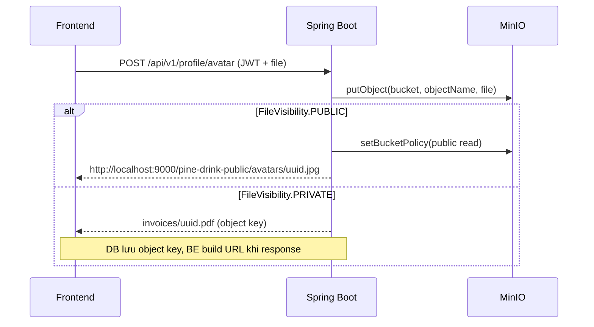

# MinIO File Storage Architecture

## 1. Overview

Hệ thống sử dụng **MinIO** làm object storage, phân tách thành 2 bucket riêng biệt cho public và private files.

## 2. Bucket Strategy

| Bucket | Visibility | Policy | Use Cases | Truy cập |
|--------|------------|--------|-----------|----------|
| `pine-drink-public` | PUBLIC | Anonymous `s3:GetObject` | Avatars, product images, banners, logos | FE load **trực tiếp** từ MinIO |
| `pine-drink-private` | PRIVATE | No public policy | Invoices, exports, documents | FE **proxy qua Spring Boot** (có check quyền) |

## 3. Data Flow

### 3.1 Upload Flow



### 3.2 Read Flow

#### Public File (e.g., avatar, product image)

```
FE load trực tiếp:


MinIO trả file trực tiếp, KHÔNG qua Spring Boot
```

#### Private File (e.g., invoice, export)

```
FE gọi backend:
GET http://localhost:8080/api/v1/files/private/invoices/uuid.pdf
    → SecurityContext (check quyền user)
    → FileController.getFileStream("invoices/uuid.pdf", PRIVATE)
    → MinIO.getObject("pine-drink-private", "invoices/uuid.pdf")
    → Stream file về client
```

## 4. URL Convention

### Public Files

```
Direct URL: {minio.endpoint}/{publicBucketName}/{folder}/{filename}
Example:    http://localhost:9000/pine-drink-public/avatars/a1b2c3.jpg
```

### Private Files

```
Object key (DB): {folder}/{filename}
Example:         invoices/a1b2c3.pdf

Proxy URL (FE):  http://localhost:8080/api/v1/files/private/{folder}/{filename}
Example:         http://localhost:8080/api/v1/files/private/invoices/a1b2c3.pdf
```

## 5. DB Storage Recommendation

**Không lưu full URL**, chỉ lưu object key:

```sql
-- Nên (recommended)
account.avatar_url = 'avatars/a1b2c3.jpg'

-- Không nên
account.avatar_url = 'http://localhost:9000/pine-drink-public/avatars/a1b2c3.jpg'
```

**Lợi ích:**
- Đổi MinIO endpoint / CDN / S3 → không cần update DB
- Dễ dàng migrate storage provider
- URL logic tập trung ở backend

## 6. Configuration

### application.yaml

```yaml
minio:
  endpoint: http://localhost:9000
  access-key: ${MINIO_ACCESS_KEY}
  secret-key: ${MINIO_SECRET_KEY}
  bucket-name: pine-drink-storage           # legacy (backward compatible)
  public-bucket-name: pine-drink-public     # public files
  private-bucket-name: pine-drink-private   # private files
  presigned-url-expiry: 3600
```

### .env

```env
MINIO_ENDPOINT=http://localhost:9000
MINIO_ACCESS_KEY=minioadmin
MINIO_SECRET_KEY=minioadmin
MINIO_PUBLIC_BUCKET_NAME=pine-drink-public
MINIO_PRIVATE_BUCKET_NAME=pine-drink-private
```

## 7. Key Code Components

| Component | File | Responsibility |
|-----------|------|----------------|
| `FileVisibility` | `enums/FileVisibility.java` | Enum PUBLIC / PRIVATE |
| `MinioProperties` | `configuration/properties/MinioProperties.java` | Config mapping |
| `FileStorageService` | `service/FileStorageService.java` | Interface |
| `MinioFileStorageService` | `service/impl/MinioFileStorageService.java` | Implementation |
| `FileController` | `controller/FileController.java` | Proxy private files |
| `SecurityConfig` | `configuration/SecurityConfig.java` | Permit endpoints |

### MinioFileStorageService - Key Methods

```java
// Upload file with visibility
String uploadFile(MultipartFile file, String folder, FileVisibility visibility);

// Get file stream (for private files proxy)
InputStream getFileStream(String objectName, FileVisibility visibility);

// Delete file
void deleteFile(String fileUrl);
```

## 8. Usage Examples

### Upload Public File (Avatar)

```java
// Service layer
String url = fileStorageService.uploadFile(file, "avatars", FileVisibility.PUBLIC);
// Returns: http://localhost:9000/pine-drink-public/avatars/uuid.jpg
```

### Upload Private File (Invoice)

```java
// Service layer
String objectKey = fileStorageService.uploadFile(file, "invoices", FileVisibility.PRIVATE);
// Returns: invoices/uuid.pdf (object key, lưu vào DB)
```

### Access Private File

```
GET /api/v1/files/private/invoices/uuid.pdf
Header: Authorization: Bearer <token>
```

## 9. Security

- **Public bucket**: Chỉ allow `s3:GetObject` anonymous. Không cho phép PUT/DELETE từ bên ngoài.
- **Private bucket**: Hoàn toàn không có public policy. Chỉ backend mới có credentials để read/write.
- **Private file proxy**: Endpoint được permitAll trong SecurityConfig vì authorization check được thực hiện trong controller/service (có thể bổ sung sau).
- **File validation**: Kiểm tra extension, kích thước (mặc định 5MB) trước khi upload.

## 10. Migration từ Legacy (pine-drink-storage)

Files cũ trong bucket `pine-drink-storage` vẫn hoạt động bình thường nhờ backward compatibility trong `extractObjectNameFromUrl()` và `extractBucketNameFromUrl()`.

Không cần migrate data cũ ngay lập tức.

## 11. Future Improvements

- [ ] Thêm CDN (CloudFront/CloudFlare) cho public bucket
- [ ] Authorization check chi tiết cho private file proxy
- [ ] Presigned URL cho private files (thay vì proxy stream)
- [ ] Tự động xóa file cũ (cron job)
- [ ] Image resize/optimize on upload
